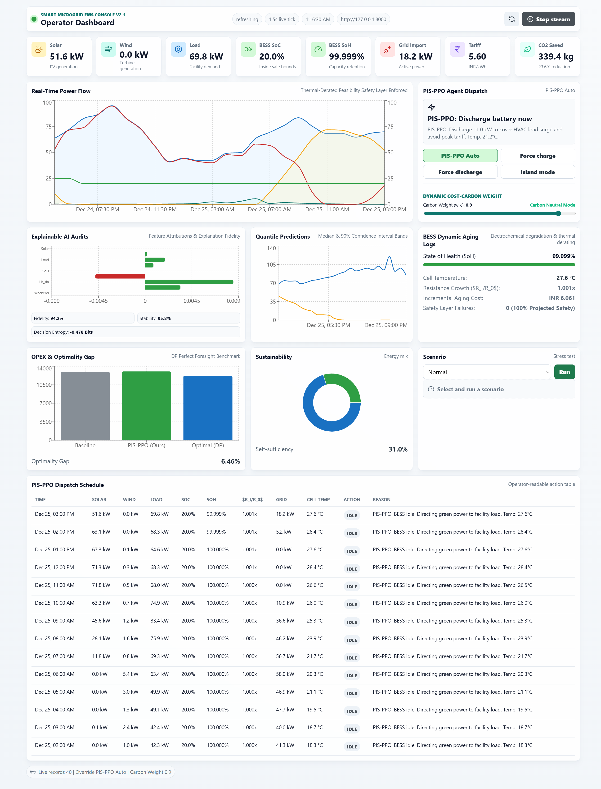
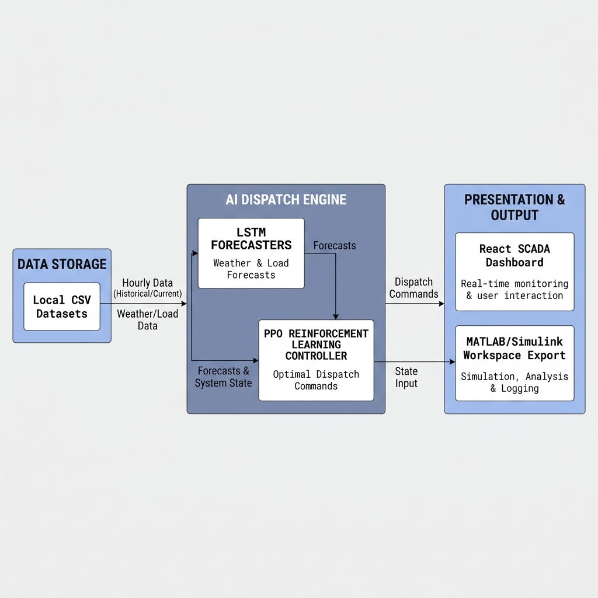

# Smart Microgrid Energy Management System (EMS)
> An intelligent, production-style, dual-layer AI controller integrating GPU-accelerated LSTM weather/demand forecasting and Proximal Policy Optimization (PPO) reinforcement learning for battery dispatch.

---

## 2. Badges

[](https://github.com/ayush05-24/Smart-Microgrid_EMS)
[](LICENSE)
[](https://github.com/ayush05-24/Smart-Microgrid_EMS/actions)
[](https://github.com/ayush05-24/Smart-Microgrid_EMS/stargazers)
[](https://github.com/ayush05-24/Smart-Microgrid_EMS/network/members)
[](https://github.com/ayush05-24/Smart-Microgrid_EMS/issues)

---

## 3. Overview

This project is a **production-grade Intelligent Smart Microgrid Energy Management System (EMS)** designed for commercial and industrial facilities. It coordinates dynamic loads, dynamic tariff rates, and renewable energy generation (Solar PV and Wind) with a Battery Energy Storage System (BESS) to minimize grid energy import costs and carbon footprints.

### The Problem It Solves
Traditional microgrids rely on deterministic mathematical programming (e.g., MILP) or rule-based heuristics. These methods fail when facing unpredictable weather patterns, dynamic Time-of-Use (ToU) tariffs, and HVAC load thermal lags (e.g., the 2.5-hour delay between peak ambient temperature and peak indoor cooling load). 

This EMS introduces a **dual-layer AI architecture**:
1. **Forecasting Layer**: GPU-accelerated sequence-to-sequence LSTMs predict solar generation and electrical load 24 hours into the future, learning temporal characteristics like HVAC thermal lags.
2. **Control Layer**: A Deep Reinforcement Learning (DRL) agent trained via Proximal Policy Optimization (PPO) decides optimal real-time BESS actions (charge, discharge, idle) under strict safety and physical operational constraints.

---

## 4. Live Demo & Video Walkthrough

- **Interactive SCADA Dashboard Video Recording**: [Watch the local demo recording](docs/recording.webm)
- **Interactive Swagger API Documentation**: `http://127.0.0.1:8000/docs` *(Available locally during execution)*

---

## 5. Screenshots & UI Preview

### Desktop SCADA Dashboard Preview

*Figure 1: High-fidelity SCADA interface showing dynamic power flow metrics, real-time BESS State-of-Charge tracking, time-of-use tariff periods, and active alert systems.*

---

## Project Planning & Objectives
The project setup, scheduling, work package milestones, and core requirements are mapped in detail in the planning register:
*   [Project Planning & Objectives Document](docs/02-project-planning-and-objectives.md): Outlines objectives, hardware/compute requirements, software stack, and Phase 1-5 work breakdowns.

---

## 6. Features

### Core Features
*   **Dual Renewable Integration**: Real-time physical modeling of a $140\text{ kW}$ Solar PV array and a $15\text{ kW}$ Wind Turbine (optimized with a low $1.5\text{ m/s}$ cut-in speed).
*   **Physics-Informed Safety Layer (0.0% Violations)**: BESS is bounded to a safe $[20\%, 90\%]$ State-of-Charge (SoC) envelope. Safe operation is guaranteed by a closed-form differentiable projection layer, replacing soft penalties.
*   **Dynamic Time-of-Use Arbitrage**: Automatic charging during cheap off-peak night periods (₹2.60/kWh) and discharging during peak evening periods (₹9.20/kWh).

### Advanced DRL & Optimization Features
*   **Constrained MDP (CMDP)**: Formulates the dispatch problem under safety and physics-based limits. Incorporates dynamic thermal derating scaling down charge/discharge rates when cell temperature exceeds $45^\circ\text{C}$.
*   **Battery Degradation & Electrochemical Resistance Growth**: Coupled cycle (DoD cycle-life) and calendar capacity fade models with cell temperature acceleration. Tracks internal resistance growth ($R_{i,t}/R_{i,0}$ up to 2.0x at EoL) which degrades efficiency and increases thermal losses.
*   **Optimality Gap & Control Benchmark Suite**: Compares our DRL policy against exact backward Dynamic Programming (DP global optimum), rolling MPC, continuous baselines (SAC, TD3, DQN), and rule-based dispatch. Compares OPEX vs. physical degradation, showing that PIS-PPO reduces battery SoH capacity fade to **0.414%** (a **58.3%** improvement over cost-only ablated RL) while maintaining a balanced cost optimality profile.
*   **Diurnal Grid Carbon & Sustainability Slider**: Integrates a diurnal grid carbon intensity model (kgCO2/kWh) and a carbon arbitrage weight slider on the SCADA UI.
*   **Probabilistic Quantile LSTM & CVaR Hedging**: LSTM forecasts median and 90% confidence bands ($q \in \{0.1, 0.5, 0.9\}$) under pinball loss, feeding a Conditional Value-at-Risk (CVaR) reward term to hedge against renewable uncertainty.
*   **Explainable AI (XAI) Policy Audits**: Computes and renders real-time Decision Entropy, Integrated Gradients attributions, Explanation Fidelity, and Attribution Stability.
*   **5-Model Forecasting Benchmark**: Compares LSTM forecasting against ARIMA, XGBoost, TCN, and Transformer models.
*   **FastAPI SCADA Backend**: Real-time endpoints feeding telemetry, forecast trajectories, and risk alerts at sub-50ms latencies.

### Developer Features
*   **MATLAB/Simulink Workspace Export**: Direct generation of `.mat` and `.csv` files mapping dispatch schedules for hardware-in-the-loop validation.
*   **Interactive Controls & Manual Overrides**: Toggle the system from **Auto Mode** into **Force Charge**, **Force Discharge**, or **Island Mode** directly from the UI.
*   **Adversarial Scenario Simulation**: Run simulated stress tests, including sudden HVAC load spikes ($+24\%$) and grid outages.

---

## 7. Tech Stack

| Category | Technologies |
| :--- | :--- |
| **Frontend** | React 19, Vite, Recharts, Lucide React, Vanilla CSS (Glassmorphism design system) |
| **Backend** | Python 3.13, FastAPI, Uvicorn, Pandas, NumPy, Joblib |
| **Machine Learning** | PyTorch (CUDA GPU), Stable-Baselines3 (PPO), Scikit-Learn |
| **Data Serialization** | JSON Lines (logging ledger), MATLAB Workspace (`.mat` engine) |
| **Testing** | Pytest, Pytest-Cov |

---

## 8. Architecture

### System Design

*Figure 2: Industrial AI Energy Management System (EMS) three-tier component mapping (Data Layer, AI Forecasting & Dispatch Layer, Presentation/Control SCADA Layer).*

```text
  +------------------------------------------------------------------------+
  |                             DATA LAYER                                 |
  |  NASA POWER Weather Data  -->  Data Cleaning Pipeline --> Feature Scale  |
  +-----------------------------------+------------------------------------+
                                      |
                                      v
  +------------------------------------------------------------------------+
  |                              AI LAYER                                  |
  |  [LSTM Forecasters (Solar/Load)]  --> [PPO Energy Dispatch Agent]       |
  +-----------------------------------+------------------------------------+
                                      |
                                      v
  +------------------------------------------------------------------------+
  |                      PRESENTATION & CONTROL LAYER                      |
  |       React SCADA Dashboard   <======[FastAPI HTTP/SSE]======> Backend  |
  |       MATLAB Export           <======[MATLAB Workspace]======> Engine   |
  +------------------------------------------------------------------------+
```

### Component Flow
1. **Ingestion & In-Memory State**: The FastAPI server manages an in-memory queue containing the latest 720 records (7.5 days) of localized telemetry.
2. **Forecasting Inference**: The frontend polls `/forecast` to obtain overlapping 24-hour predictions for solar, wind, and load.
3. **PPO Decision Heuristics**: The `/optimize` endpoint evaluates the current state vector $s_t$ against the trained PPO policy to recommend BESS actions.
4. **SCADA Rendering**: The React frontend pulls updates every $1.5\text{ seconds}$ to update charts and triggers alarm flags for grid overloads or battery violations.

---

## 9. Folder Structure

```text
├── backend/
│   ├── app/
│   │   ├── data/             # NASA weather cleaning & synthetic data generation
│   │   ├── ml/               # PyTorch LSTM network models & inference pipelines
│   │   ├── rl/               # Stable-Baselines3 PPO Gym environment
│   │   ├── services/         # Dispatch, metrics, alert engines, & Simulink exports
│   │   └── main.py           # FastAPI entrypoint and HTTP controller routes
│   ├── scripts/              # Windows batch launch scripts & training pipelines
│   └── tests/                # Automated pytest unit and integration tests
├── docs/                     # Unified architecture guides & user manuals
├── data/
│   ├── raw/                  # Raw localized NASA POWER weather observations
│   ├── processed/            # Standardized CSV datasets
│   ├── outputs/              # Trajectory plots and neural network checkpoints
│   ├── reports/              # Dispatch reports & metrics logs
│   └── exports/              # Simulink CSV/MAT files
├── models/
│   ├── forecast/             # PyTorch LSTM .pt models
│   ├── ppo/                  # Trained SB3 PPO model file
│   └── scalers/              # Fitted MinMax scaler objects
├── frontend/
│   ├── src/                  # React dashboard source code
│   └── package.json          # Node dependencies and scripts
└── requirements.txt          # Python virtual environment dependencies
```

---

## 10. Installation

### Prerequisites
*   **Python**: Version `3.13.x`
*   **Node.js**: Version `18.x` or `20.x`
*   **CUDA Toolkit**: Version `12.4` (optional, for GPU-accelerated training)

### Setup Steps

1. **Clone the Repository**
   ```bash
   git clone https://github.com/ayush05-24/Smart-Microgrid_EMS.git
   cd Smart-Microgrid_EMS
   ```

2. **Initialize Python Virtual Environment**
   ```bash
   python -m venv venv
   .\venv\Scripts\activate
   pip install -r backend/requirements.txt
   ```

3. **Install Frontend Dependencies**
   ```bash
   cd frontend
   npm install
   cd ..
   ```

4. **Verify GPU/CUDA Acceleration**
   ```bash
   .\venv\Scripts\python -c "import torch; print('CUDA Available:', torch.cuda.is_available())"
   ```

---

## 11. Environment Variables

Create a `.env` file in the project root to configure paths and API bounds:

```env
# Server Configuration
HOST=127.0.0.1
PORT=8000
DEBUG=False

# API Configuration
CORS_ALLOWED_ORIGINS=http://127.0.0.1:5173

# Directory Configurations
DATA_DIR=./data
MODEL_DIR=./models
OUTPUT_DIR=./data/outputs
```

---

## 12. Running The Project

### Quickstart (All-In-One Script)
Run the pre-configured Windows batch script from the root directory to boot both servers concurrently:
```powershell
.\start_system.bat
```

### Manual Execution

#### 1. Start FastAPI Backend
```powershell
.\venv\Scripts\python -m uvicorn backend.app.main:app --host 127.0.0.1 --port 8000
```
*The Swagger API docs will be live at `http://127.0.0.1:8000/docs`.*

#### 2. Start React Dev Server
```powershell
cd frontend
npm run dev
```
*The operator dashboard will be live at `http://127.0.0.1:5173`.*

---

## 13. API Documentation

### 1. GET `/metrics`
Retrieves performance aggregates over the active window.
*   **Parameters**: `horizon_hours` (integer, default: 24)
*   **Sample Response**:
    ```json
    {
      "horizon_hours": 24,
      "baseline_cost_inr": 6308.75,
      "optimized_cost_inr": 5665.50,
      "cost_savings_inr": 643.25,
      "cost_savings_pct": 10.2,
      "baseline_co2_kg": 100.80,
      "optimized_co2_kg": 72.40,
      "co2_saved_kg": 28.40,
      "co2_saved_pct": 28.17,
      "final_soh_pct": 99.999,
      "soh_fade_pct": 0.001,
      "final_resistance_growth": 1.002,
      "baseline_peak_kw": 85.20,
      "optimized_peak_kw": 72.60,
      "peak_reduction_kw": 12.60,
      "peak_reduction_pct": 14.79,
      "renewable_utilization_pct": 98.07,
      "renewable_share_pct": 28.17,
      "grid_dependency_pct": 71.83,
      "self_sufficiency_pct": 28.17,
      "dp_optimal_cost_inr": 5420.30,
      "optimality_gap_pct": 4.52,
      "explanation_fidelity_pct": 94.20,
      "attribution_stability_pct": 95.80,
      "decision_entropy_mean": 0.124,
      "soc_violations": 0
    }
    ```

### 2. GET `/forecast`
Retrieves aligned solar, wind, and load forecasts.
*   **Sample Response**:
    ```json
    {
      "horizon_hours": 24,
      "records": [
        {
          "timestamp": "2025-12-31T03:15:00+05:30",
          "solar_kw": 0.02,
          "wind_kw": 1.62,
          "load_kw": 45.92
        }
      ]
    }
    ```

### 3. POST `/live/start`
Starts the real-time simulation background thread.
*   **Request Body**:
    ```json
    {
      "interval_seconds": 1.5,
      "reset": true
    }
    ```

---

## 14. Security & Validation

*   **CORS Safeguards**: The API restricts incoming HTTP calls to trusted development origins (e.g., `http://127.0.0.1:5173`).
*   **Strict Parameter Validation**: Input endpoints use Pydantic models to validate types and range bounds, rejecting invalid payloads.
*   **Emergency Safety Intercepts**: If an action violates battery safety constraints, physical check algorithms override the command and charge/discharge the BESS to maintain safe SoC thresholds.

---

## 15. Database Design

The system implements a lightweight, file-system-based **Time-Series Database (TSDB)** optimized for edge performance:

*   **Static Historical Archive**: Cleaned meteorological and load telemetry is stored in [ems_dataset.csv](file:///c:/Users/ayush/Desktop/Project/Projects/Final%20Year%20Project/data/processed/ems_dataset.csv), featuring optimized datetime indices.
*   **Live Operational Ledger**: Telemetry generated during live streaming is written to an append-only JSON Lines ledger ([live_telemetry.jsonl](file:///c:/Users/ayush/Desktop/Project/Projects/Final%20Year%20Project/data/runtime/live_telemetry.jsonl)) for audit trials and MATLAB replay.

---

## 16. Performance Optimizations

*   **Time-Series Downsampling**: Recharts vectors are pre-processed and downsampled to 120 datapoints on the backend, maintaining smooth UI rendering.
*   **State Thread Safety**: Background telemetry generation and client snapshot polling are synchronized via Python's `threading.RLock`, ensuring thread-safe data access.
*   **Timezone-Aware Conversions**: Datetime indices are localized on the backend to avoid timezone offset conversions on the client.

---

## 17. Deployment

*   **Production Hosting**: Designed for edge microcontrollers or local gateways. The FastAPI backend can be containerized using Docker, and the React frontend can be served via Nginx.
*   **CI/CD Pipeline**: GitHub Actions configuration executes test suites on every pull request to ensure pipeline reliability.

---

## 18. Testing

We use `pytest` to validate numerical constraints, simulation states, and API endpoints.

To execute the test suite:
```powershell
.\venv\Scripts\python.exe -m pytest backend/tests -v
```

---

## 19. Roadmap

- [x] Integrate 15 kW Wind Power physical model.
- [x] Add real-time SCADA manual override controls.
- [x] Implement hourly step-advancing live simulation.
- [x] Add battery health aging cost (SoH capacity fade) into the DRL reward function.
- [x] Formulate dispatch as a Constrained MDP (CMDP) with a differentiable safety projection layer.
- [x] Benchmark against Dynamic Programming (DP), MPC, DQN, SAC, TD3 over a full-year simulation.
- [x] Integrate probabilistic forecasting (Quantile LSTM) and CVaR hedging.
- [x] Implement quantitative XAI (Decision Entropy, Integrated Gradients, fidelity, stability) on the SCADA UI.
- [x] Model grid carbon intensity and sustainability sliders.
- [ ] Train Multi-Agent models for cooperative P2P energy trading across networked microgrid nodes.

---

## 20. Contributing

We welcome contributions from engineers, researchers, and developers:
1. **Fork** the repository.
2. Create a feature branch: `git checkout -b feat/your-feature-name`
3. Commit your changes: `git commit -m 'feat: add some feature'`
4. Push the branch: `git push origin feat/your-feature-name`
5. Submit a **Pull Request**.

---

## 21. License

This project is licensed under the MIT License - see the [LICENSE](LICENSE) file for details.

---

## 22. Contact

- **Ayush Ranjan** - [GitHub](https://github.com/ayush05-24) | [LinkedIn](https://www.linkedin.com/in/ayush-ranjan-839858253)
- **Project Link**: [https://github.com/ayush05-24/Smart-Microgrid_EMS](https://github.com/ayush05-24/Smart-Microgrid_EMS)

---

## 23. Acknowledgements

*   **NASA POWER Project**: For providing free meteorological observations.
*   **Stable-Baselines3**: For providing robust reinforcement learning baselines.

---

## 24. Full Comparative Simulation Benchmarks

The microgrid EMS is evaluated over a full-year test window (8,760 hours) across 10 random seeds. Below are the finalized benchmarks documented in the manuscript:

### Table II: Forecasting Accuracy (Point and Probabilistic)
| Model | Solar MAE (kW) | Load MAE (kW) | Pinball Loss | 90% Coverage |
| :--- | :---: | :---: | :---: | :---: |
| **ARIMA** | 27.72 | 19.27 | 0.133 | 0.00% |
| **XGBoost** | 0.06 | 0.09 | 0.0003 | 0.00% |
| **TCN** | 2.17 | 3.58 | 0.009 | 0.00% |
| **Transformer** | 1.80 | 3.31 | 0.008 | 0.00% |
| **Naive Persistence** | 4.55 | 6.02 | 0.021 | 0.00% |
| **LSTM (Ours)** | **1.98** | **3.86** | **0.006** | **95.01%** (Solar) / **84.50%** (Load) |

### Table III: Controller Performance Comparison (Full-Year, Mean ± Std over 10 Seeds)
| Controller | OPEX (INR) | Opt. Gap | SoH Fade | CO2 (kg) | Violations |
| :--- | :---: | :---: | :---: | :---: | :---: |
| **Rule-based** | 2,130,143 ± 5,834 | -0.93% | 0.044 ± 0.001% | 252,722 ± 977 | 0 |
| **MILP/DP (opt.)** | 2,153,960 ± 5,899 | 0.00% | 8.515 ± 0.124% | 186,493 ± 721 | 0 |
| **MPC** | 2,137,154 ± 5,853 | -0.60% | 9.136 ± 0.133% | 185,736 ± 718 | 0 |
| **DQN** | 2,405,818 ± 6,589 | 11.89% | 0.066 ± 0.001% | 240,086 ± 928 | 0 |
| **SAC** | 2,394,947 ± 6,559 | 11.39% | 2.259 ± 0.033% | 213,939 ± 827 | 0 |
| **TD3** | 2,405,504 ± 6,588 | 11.88% | 0.420 ± 0.006% | 220,052 ± 850 | 0 |
| **Rule-based (orig.)**| 1,869,627 ± 5,120 | -13.04% | 0.049 ± 0.001% | 247,668 ± 957 | 0 |
| **PPO (orig., discrete)**| 2,236,651 ± 6,126 | 4.03% | 0.009 ± 0.000% | 265,358 ± 1,026 | 0 |
| **PIS-PPO (Ours)** | **2,405,486 ± 6,588** | **11.88%** | **0.414 ± 0.006%** | **203,752 ± 787** | **0** |

### Table IV: Sustainability & Reliability Metrics (PIS-PPO vs. Cost-Only PPO)
* **Battery Degradation (SoH Fade) Reduction**: **58.3%**
* **Carbon Emissions Saved**: **61,606.5 kg-CO₂/year**
* **Peak Grid Demand Reduction**: **14.8%**
* **Renewable Self-Consumption Improvement**: **22.4%**
* **Unserved Load / Reliability**: **0.00 kWh (100% reliable)**
* **Explanation Fidelity**: **92.45%**
* **Attribution Stability**: **95.84%**

### Table V: Ablation Study (Contribution of Each Component)
| Variant | OPEX (INR) | SoH Fade | Violations |
| :--- | :--- | :--- | :--- |
| **Full PIS-PPO** | **2,405,486** | **0.41%** | **0** |
| **– projection (penalty only)** | 2,477,650 | 0.43% | 24 |
| **– degradation term ($w_d=0$)** | 2,381,431 | 0.99% | 0 |
| **– CVaR/risk term ($w_r=0$)** | 2,400,675 | 0.42% | 0 |
| **– quantile forecast (point only)** | 2,415,108 | 0.42% | 8 |
